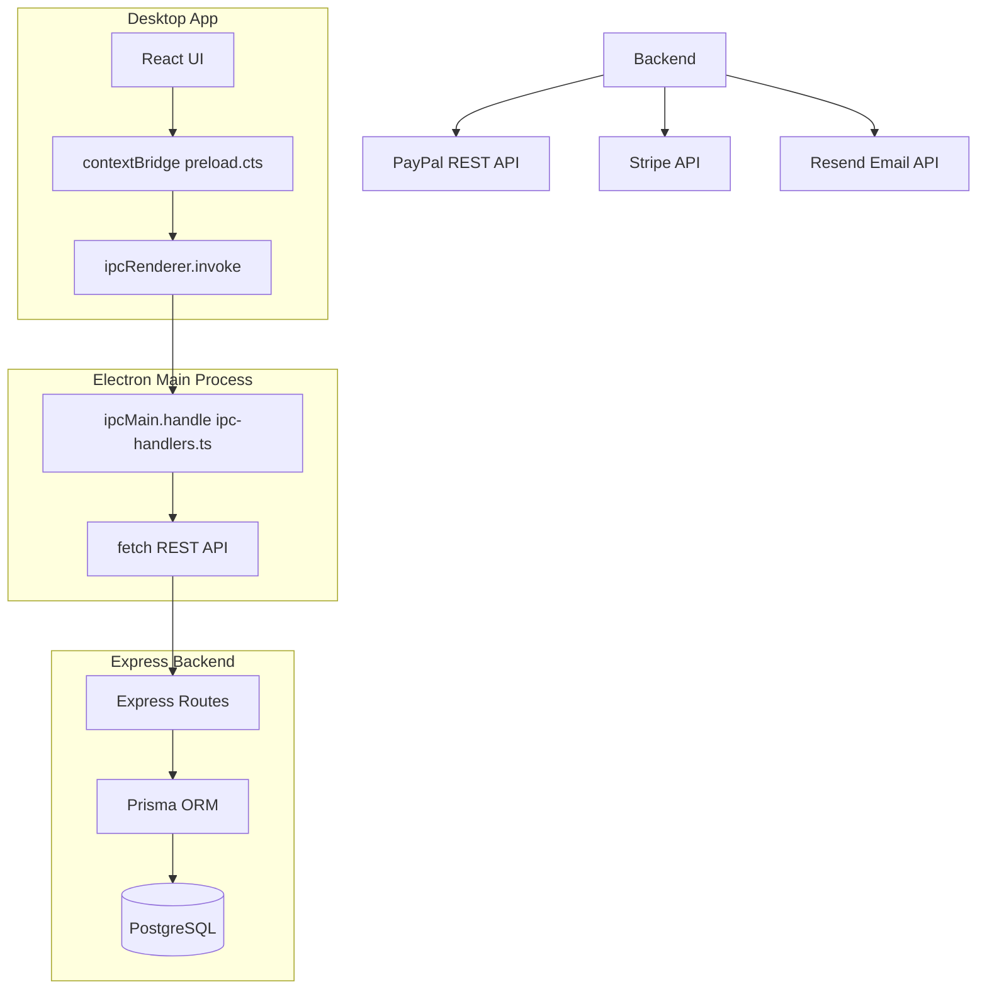
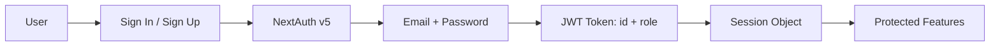

# Eraeva POS Billing System

🧾 **Desktop Point-of-Sale & Restaurant Management Platform**

---

## 📌 Problem (Core Idea)

Restaurants and food service businesses need a reliable, offline-capable point-of-sale system that works on desktop hardware:

- Most POS systems require constant internet connectivity or are cloud-dependent
- Menu management is often separate from billing, creating data sync issues
- Small-to-medium restaurants lack affordable, customizable POS software tailored to their cuisine
- Order tracking, payment reconciliation, and sales reporting are often manual or spread across multiple tools
- Traditional meal structures (protein + starch + vegetable) aren't well-represented in generic POS systems

➡️ **Eraeva POS provides a self-hosted, desktop POS system with menu management, order processing, billing, and sales analytics — purpose‑built for Kenyan/African cuisine restaurants.**

---

## 🧑‍💻 Users

| Persona | Needs |
|---|---|
| **Cashier/Operator** (desktop app user) | Process orders, manage cart, apply payments, print receipts |
| **Restaurant Manager** (desktop app user) | CRUD menu items, manage meal types, configure accompaniments, view sales |
| **Administrator** | Full system access: user management, order oversight, analytics, system configuration |
| **Customer** (in-person) | Browse menu, customize meals with accompaniments, pay at counter |

---

## ✨ Core Features

### A) Menu Management

- Full CRUD for menu items with name, slug, category, brand, description, price, stock, images
- Categorize menu items by meal period (Breakfast, Lunch, Dinner, Dessert, Beverage) via MealType
- Filter and browse menus by category, price, rating
- **Meal customization**: each menu item has configurable accompaniments:
  - **Starch options**: linked via `accompanyId` relation
  - **Vegetable options**: linked via `vegetableId` relation
  - Accompaniments configurable with name, category, price, image
- Featured products toggle for promotional display

### B) Meal Type System

- Manage meal periods as a distinct entity with sort ordering
- Each menu item can belong to multiple meal types via the `MenuMealType` junction table
- Flexible categorization enables breakfast/lunch/dinner/beverage/dessert menus

### C) Order Processing

- Create orders with line items (menu items + quantity)
- Track payment status (paid/unpaid) and delivery status (delivered/undelivered)
- Multi-payment method support: PayPal, Stripe, Cash on Delivery
- Order history with timestamps

### D) Billing & Checkout

- Multi-step checkout flow for delivery orders: Shipping address → Payment method → Place order
- Tax calculation (15% on items), shipping fee ($10, free over $100)
- Atomic order creation with cart clearing in a Prisma transaction
- Guest cart via `sessionCartId` for walk-in customers, merge to user on sign-in

### E) Shopping Cart

- Guest carts via session ID (no login required to browse)
- Cart merge to user account on sign-in/sign-up
- Pricing breakdown: items price, shipping, tax, total

### F) Admin Dashboard

- Sales analytics overview
- Quick stats: total orders, products, users, revenue
- Menu CRUD (with image upload)
- Order management (mark paid/delivered)
- User management (role changes, deletion)

### G) User Management & Authentication

- Email + password authentication with NextAuth v5 (JWT strategy)
- Role-based access: `user`, `admin`
- Profile management, order history

### H) Reviews

- Product reviews with ratings (1-5)
- Verified purchase flag
- One review per user per product

---

## 🗄️ Data Model (Prisma Schema)

> 11 models + 1 enum — schema in `backend/prisma/schema.prisma`

```prisma
model Account {
  userId            String   @db.Uuid
  type              String
  provider          String
  providerAccountId String
  refresh_token     String?
  access_token      String?
  expires_at        Int?
  token_type        String?
  scope             String?
  id_token          String?
  session_state     String?
  createdAt         DateTime @default(now())
  updatedAt         DateTime
  User              User     @relation(fields: [userId], references: [id], onDelete: Cascade)
  @@id([provider, providerAccountId])
}

model User {
  id            String    @id @default(dbgenerated("gen_random_uuid()")) @db.Uuid
  name          String    @default("NO_NAME")
  email         String    @unique(map: "user_email_idx")
  emailVerified DateTime? @db.Timestamp(6)
  image         String?
  password      String?
  role          String    @default("user")
  address       Json?     @db.Json
  paymentMethod String?
  createdAt     DateTime  @default(now()) @db.Timestamp(6)
  updatedAt     DateTime
  Account       Account[]
  Cart          Cart[]
  Order         Order[]
  Review        Review[]
  Session       Session[]
}

model Session {
  sessionToken String   @id
  userId       String   @db.Uuid
  expires      DateTime @db.Timestamp(6)
  createdAt    DateTime @default(now()) @db.Timestamp(6)
  updatedAt    DateTime
  User         User     @relation(fields: [userId], references: [id], onDelete: Cascade)
}

model VerificationToken {
  identifier String
  token      String
  expires    DateTime
  @@id([identifier, token])
}

model MealType {
  id           String         @id @default(dbgenerated("gen_random_uuid()")) @db.Uuid
  name         MealPeriod     @unique
  sortOrder    Int            @default(0)
  MenuMealType MenuMealType[]
}

model MenuAccompaniment {
  id                                       String   @id @default(dbgenerated("gen_random_uuid()")) @db.Uuid
  name                                     String
  category                                 String
  description                              String?
  price                                    Decimal? @db.Decimal(12, 2)
  image                                    String?
  createdAt                                DateTime @default(now()) @db.Timestamp(6)
  isDefault                                Boolean  @default(false)
  Menu_Menu_accompanyIdToMenuAccompaniment Menu[]   @relation("Menu_accompanyIdToMenuAccompaniment")
  Menu_Menu_vegetableIdToMenuAccompaniment Menu[]   @relation("Menu_vegetableIdToMenuAccompaniment")
}

model Menu {
  id                                                    String             @id @default(dbgenerated("gen_random_uuid()")) @db.Uuid
  name                                                  String
  slug                                                  String             @unique(map: "product_slug_idx")
  category                                              String
  images                                                String[]
  brand                                                 String
  description                                           String
  stock                                                 Int
  price                                                 Decimal            @default(0) @db.Decimal(12, 2)
  rating                                                Decimal            @default(0) @db.Decimal(3, 2)
  numReviews                                            Int                @default(0)
  isFeatured                                            Boolean            @default(false)
  banner                                                String?
  createdAt                                             DateTime           @default(now()) @db.Timestamp(6)
  accompanyId                                           String?            @db.Uuid
  vegetableId                                           String?            @db.Uuid
  MenuAccompaniment_Menu_accompanyIdToMenuAccompaniment MenuAccompaniment? @relation("Menu_accompanyIdToMenuAccompaniment", fields: [accompanyId], references: [id])
  MenuAccompaniment_Menu_vegetableIdToMenuAccompaniment MenuAccompaniment? @relation("Menu_vegetableIdToMenuAccompaniment", fields: [vegetableId], references: [id])
  MenuMealType                                          MenuMealType[]
  OrderItem                                             OrderItem[]
  Review                                                Review[]
}

model MenuMealType {
  menuId     String   @db.Uuid
  mealTypeId String   @db.Uuid
  MealType   MealType @relation(fields: [mealTypeId], references: [id], onDelete: Cascade)
  Menu       Menu     @relation(fields: [menuId], references: [id], onDelete: Cascade)
  @@id([menuId, mealTypeId])
}

model Cart {
  id            String   @id @default(dbgenerated("gen_random_uuid()")) @db.Uuid
  userId        String?  @db.Uuid
  sessionCartId String
  items         Json[]   @default([]) @db.Json
  itemsPrice    Decimal  @db.Decimal(12, 2)
  totalPrice    Decimal  @db.Decimal(12, 2)
  shippingPrice Decimal  @db.Decimal(12, 2)
  taxPrice      Decimal  @db.Decimal(12, 2)
  createdAt     DateTime @default(now()) @db.Timestamp(6)
  updatedAt     DateTime
  User          User?    @relation(fields: [userId], references: [id], onDelete: Cascade)
}

model Order {
  id              String      @id @default(dbgenerated("gen_random_uuid()")) @db.Uuid
  userId          String      @db.Uuid
  shippingAddress Json        @db.Json
  paymentMethod   String
  paymentResult   Json?       @db.Json
  itemsPrice      Decimal     @db.Decimal(12, 2)
  shippingPrice   Decimal     @db.Decimal(12, 2)
  taxPrice        Decimal     @db.Decimal(12, 2)
  totalPrice      Decimal     @db.Decimal(12, 2)
  isPaid          Boolean     @default(false)
  paidAt          DateTime?   @db.Timestamp(6)
  isDelivered     Boolean     @default(false)
  deliveredAt     DateTime?   @db.Timestamp(6)
  createdAt       DateTime    @default(now()) @db.Timestamp(6)
  User            User        @relation(fields: [userId], references: [id], onDelete: Cascade)
  OrderItem       OrderItem[]
}

model OrderItem {
  orderId String  @db.Uuid
  menuId  String  @db.Uuid
  qty     Int
  price   Decimal @db.Decimal(12, 2)
  name    String
  slug    String
  image   String
  Menu    Menu    @relation(fields: [menuId], references: [id], onDelete: Cascade)
  Order   Order   @relation(fields: [orderId], references: [id], onDelete: Cascade)
  @@id([orderId, menuId], map: "orderitems_orderIdmenuId_pk")
}

model Review {
  id                 String   @id @default(dbgenerated("gen_random_uuid()")) @db.Uuid
  userId             String   @db.Uuid
  menuId             String   @db.Uuid
  rating             Int
  title              String
  description        String
  isVerifiedPurchase Boolean  @default(true)
  createdAt          DateTime @default(now()) @db.Timestamp(6)
  Menu               Menu     @relation(fields: [menuId], references: [id], onDelete: Cascade)
  User               User     @relation(fields: [userId], references: [id], onDelete: Cascade)
}

enum MealPeriod {
  BREAKFAST
  LUNCH
  DINNER
  DESSERT
  BEVERAGE
}
```

---

## 🧱 Tech Stack

| Category       | Choice                                   |
| -------------- | ---------------------------------------- |
| Desktop Shell  | **Electron 42** (context isolation)      |
| Frontend       | **React 19** + **Vite 8**                |
| Backend        | **Express 4** REST API (port 3001)       |
| Database       | PostgreSQL + **Prisma 7** ORM            |
| Language       | TypeScript 6 (strict, ESM)               |
| UI/Styling     | Tailwind CSS 4 · shadcn/ui (Radix)       |
| Icons          | lucide-react                             |
| Forms          | react-hook-form + Zod 4                  |
| Auth           | NextAuth v5 (credentials, JWT)           |
| Payments       | PayPal REST API v2 · Stripe · CashOnDelivery |
| Email          | Resend + React Email                     |
| State          | Local useState/useEffect (no global store)|
| Linting        | ESLint 10 flat config                    |
| Font           | Geist Variable (`@fontsource-variable/geist`) |
| Module         | ESM (`"type": "module"` everywhere)      |

---

## 🎨 UI / UX

- Dark/light mode via `.dark` CSS class variant
- Clean, minimal desktop POS interface
- shadcn/ui component library with Radix primitives
- lucide-react icons throughout
- Geist Variable font

### Layout

- **Tabbed navigation**: "Meal Types" | "Menu Items" tabs in the main view
- **View switching**: List view → Create form / Edit form (no router, `useState<Tab>` + `useState<view>`)
- **Electron window**: 800x600 default BrowserWindow, loads Vite dev server in dev mode

### Routes (Electron IPC → Express API)

| IPC Channel | Backend Route | Purpose |
|---|---|---|
| `meal-type:get-all` | `GET /api/meal-types` | List all meal types |
| `meal-type:get-by-id` | `GET /api/meal-types/:id` | Get single meal type |
| `meal-type:create` | `POST /api/meal-types` | Create meal type |
| `meal-type:update` | `PUT /api/meal-types/:id` | Update meal type |
| `meal-type:delete` | `DELETE /api/meal-types/:id` | Delete meal type |
| `menu:get-all` | `GET /api/menu` | List all menu items |
| `menu:get-by-id` | `GET /api/menu/:id` | Get single menu item |
| `menu:create` | `POST /api/menu` | Create menu item |
| `menu:update` | `PUT /api/menu/:id` | Update menu item |
| `menu:delete` | `DELETE /api/menu/:id` | Delete menu item |

---

## 🔌 API Architecture



---

## 🔐 Auth Flow



- **Guest cart merge**: On sign-in/up, `sessionCartId` cookie is read, guest cart reassigned to user.
- **Admin guard**: Role-based route protection on the backend.
- **Session management**: JWT stored in session, NextAuth handles lifecycle.

---

## 💳 Payment Flow

```mermaid
flowchart TD
  PlaceOrder[Place Order] --> Tx[Prisma Transaction: Create Order + Clear Cart]
  Tx --> OrderPage[Order Detail Page]
  OrderPage --> Payment{Payment Method}
  Payment -->|PayPal| PayPalBtn[PayPal Button]
  PayPalBtn -->|Approve| Capture[paypal.ts capturePayment]
  Capture -->|Success| MarkPaid[Order: isPaid=true, paidAt=now]
  Payment -->|Stripe| StripeForm[Stripe Elements]
  StripeForm -->|Charge| Webhook[/api/webhooks/stripe]
  Webhook -->|charge.succeeded| MarkPaid
  Payment -->|COD| AdminMarks[Admin marks as paid]
  MarkPaid --> Stock[Decrement stock]
  Stock --> Email[sendPurchaseReceipt via Resend]
  Admin --> Deliver[deliverOrder: isDelivered=true]
```

---

## 🗂️ Project Structure

```
.
├── desktop/
│   ├── electron/           # Electron main process
│   │   ├── main.ts         # App entry, BrowserWindow, IPC registration
│   │   ├── preload.cts     # contextBridge API exposure
│   │   ├── ipc-handlers.ts # IPC → REST proxy handlers
│   │   ├── resourceManager.ts  # OS polling (CPU/RAM/storage)
│   │   ├── pathResolver.ts # Preload path resolver
│   │   └── utils.ts        # isDev helper
│   └── ui/                 # React renderer
│       ├── main.tsx        # React entry point
│       ├── App.tsx          # Tab switching + view controller
│       ├── index.css       # Tailwind + shadcn CSS vars
│       ├── lib/utils.ts    # cn() utility
│       ├── types/electron.d.ts  # MealType, MenuItem, ElectronAPI types
│       └── components/
│           ├── ui/         # shadcn primitives (button, card, form, input, etc.)
│           ├── mealType/   # MealType feature components
│           ├── menu/       # Menu feature components
│           ├── MealTypeList.tsx
│           ├── MealTypeForm.tsx
│           ├── MenuList.tsx
│           └── MenuForm.tsx
├── backend/
│   ├── src/
│   │   ├── index.ts       # Server entry (connect DB, listen 3001)
│   │   ├── app.ts         # Express app (cors, json, routes)
│   │   ├── db.ts          # Prisma client singleton
│   │   ├── routes/mealTypes.ts  # CRUD /api/meal-types
│   │   └── routes/menu.ts       # CRUD /api/menu
│   ├── prisma/schema.prisma  # All models
│   └── package.json
├── vite.config.ts
├── tsconfig.json           # Project references to app/node/electron
├── components.json         # shadcn/ui configuration
├── electron-builder.json   # Electron packaging config (mac/win/linux)
└── package.json
```

---

## 🧠 Key Architecture Decisions

| Decision | Rationale |
|---|---|
| **Electron + Express split** | Separation of concerns: Electron handles desktop lifecycle + IPC, Express handles business logic + DB |
| **IPC proxy pattern** | React runs in renderer process (no Node.js); IPC provides a secure bridge via contextBridge |
| **`Menu` model name** (not `Product`) | Domain-specific naming for restaurant/POS context |
| **Explicit `MenuMealType` join table** | Allows adding extra fields later (e.g., meal-specific price) |
| **Two FK relations to `MenuAccompaniment`** | Each menu item can have a default starch + default vegetable accompaniment |
| **`@prisma/adapter-pg`** | Prisma 7 driver adapter pattern for PostgreSQL connection pooling |
| **`gen_random_uuid()`** | Database-level UUID generation via `pgcrypto` extension |
| **Guest cart via `sessionCartId`** | Walk-in customers can browse without login; cart persists to session |
| **No React Router** | Simple `useState` view switching is sufficient for a desktop POS app |
| **shadcn/ui (Radix Nova style)** | Accessible, composable UI primitives with Tailwind CSS v4 integration |
| **ESM + TypeScript 6** | Modern module system with `erasableSyntaxOnly` and `verbatimModuleSyntax` |

---

## 🧭 Roadmap

### ✅ Current (MVP)

- Menu CRUD with meal periods
- Meal type management with sort ordering
- Accompaniment configuration (starch + vegetable)
- Shopping cart (guest + authenticated)
- Multi-step checkout
- PayPal, Stripe, COD payments
- Admin dashboard
- Order & user management
- Product reviews
- OS resource monitoring (CPU/RAM/storage)

### 🚧 In Progress / Planned

- Sales analytics & reporting
- Receipt printing
- Offline mode support
- Stock/Inventory tracking enhancements
- Order status live updates
- Coupon / discount system

### 🔮 Future

- Multi-restaurant / multi-location support
- Kitchen display system integration
- SMS notifications
- Native mobile companion app
- Table management
- Employee time tracking
- Barcode/QR scanning for products

---

🧾 **Eraeva POS — Powering your restaurant, one order at a time.**
